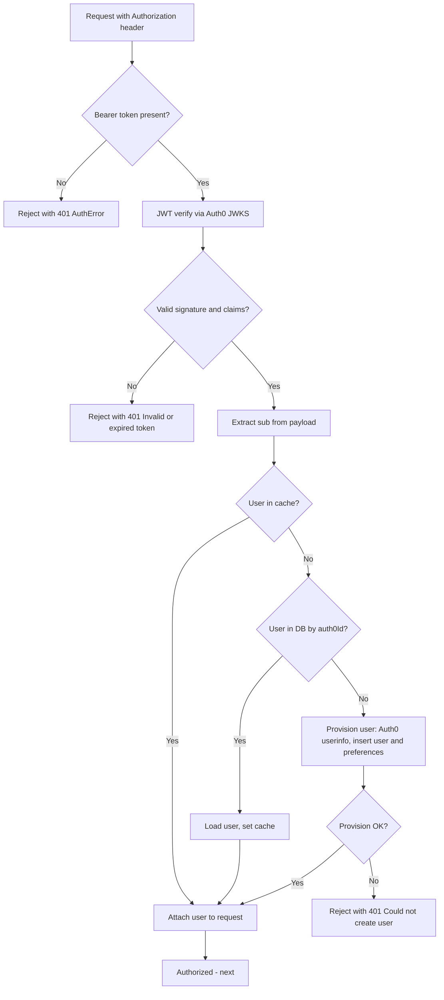

# Seeker — Authorization Flow

Mermaid diagram for the API authorization flow: `requireAuth` middleware, JWT verification, user resolution (cache / DB / provision), and outcome.

## Summary

| Step | What happens |
|------|----------------|
| **Request** | Protected route receives `Authorization: Bearer <accessToken>`. |
| **Check** | Missing or non-Bearer header throws AuthError (401). |
| **Verify** | Token verified with Auth0 JWKS (issuer, optional audience). Invalid or expired token throws AuthError (401). |
| **User resolution** | Keyed by JWT `sub`. Cache hit (60s TTL) uses cached user; else DB lookup by `auth0Id`; else provision via Auth0 userinfo and insert user + preferences. |
| **Placeholder refresh** | If user has placeholder identity, userinfo is fetched and user record updated when values differ. |
| **Outcome** | `req.user` set; request is authorized and passed to route handler. No per-resource or tier checks; all authenticated users have access to all features. |
