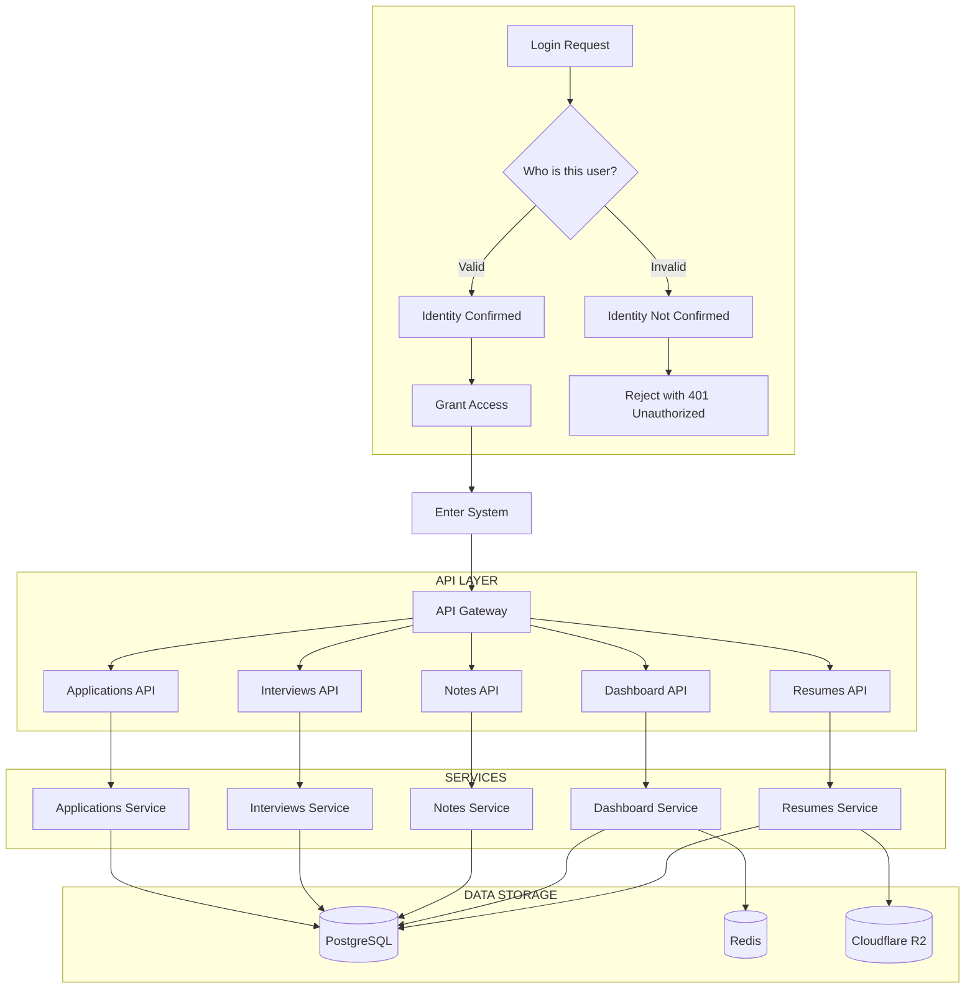

# Seeker — System Architecture Diagram

This diagram reflects the authenticated request flow: auth decision, API layer, services, and data storage. Style matches the reference visualization.

## Layer summary

| Layer | Components |
|-------|------------|
| **Auth** | Login request (Auth0), JWT verification; valid path grants access, invalid path returns 401. |
| **API Gateway** | Express server; routes to feature APIs under `/api/v1/`. |
| **API Layer** | Applications, Interviews, Notes, Dashboard, Resumes. |
| **Services** | Feature services (applications, interviews, notes, dashboard, resumes); dashboard uses cache. |
| **Data Storage** | PostgreSQL (users, applications, companies, interviews, notes, resumes metadata); Redis (dashboard metrics); Cloudflare R2 (resume files). |
